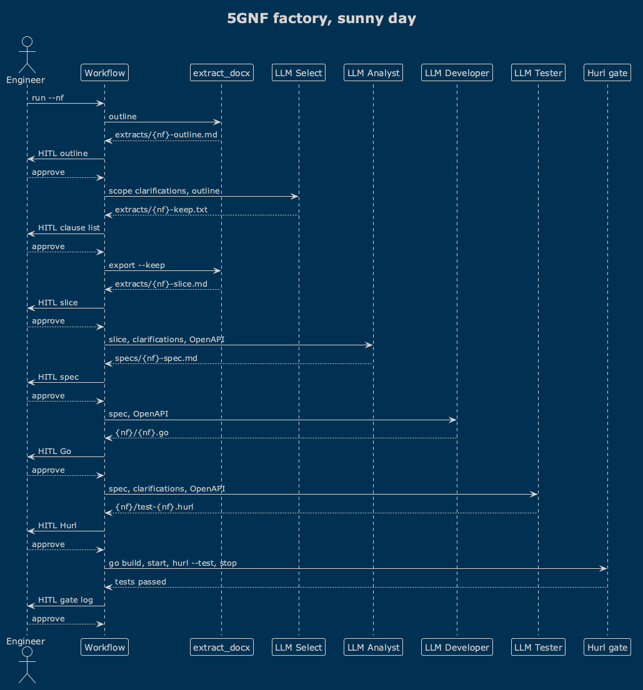

# 5GC-Factory

This repo shows an LLM inside a development process. A LangGraph workflow builds one 5G Core Network Function from a curated clause, a scope note, and an OpenAPI extract. After every stage the run pauses. User checks the results, then approves it, or re-runs that stage again, or jumps back.

The first curated set is `nrf` - Network Repository Function, responsible for registration and discovery of othe Network Functions. The same workflow takes the next Network Function in development when new files are added with the same name structure.

## Sunny day

The sequence is [diagrams/workflow-sunny-day.puml](diagrams/workflow-sunny-day.puml). In this scenario, every stage succeeds and every reply is approve.



1. User prepares `extracts/{nf}-scope-clarifications.md` file with initial development scope and clarifications (from the start or down the road).
2. Extract contents of 3GPP specification DOCX into `extracts/{nf}-outline.md` (python script, not LLM).
3. The LLM Select role reads `extracts/{nf}-scope-clarifications.md` and the context/outline, then saves the relevant paragraphs list to `extracts/{nf}-keep.txt`.
4. Export those clauses to `extracts/{nf}-slice.md` (script). Users curates and redacts the extract. 3GPP documentation is very wordy - same ideas are re-phrased multiple times in text. See "golden" artifacts for examples of shrinked text.
5. The LLM Analyst writes development spec (contract / "TZ" / feature spec) `specs/{nf}-spec.md` from the slice, the clarifications, and the OpenAPI extract.
6. The Developer writes `{nf}/{nf}.go` from the spec and the OpenAPI extract.
7. The Tester writes `{nf}/test-{nf}.hurl` from the spec, the clarifications, and the OpenAPI extract.
8. The Quality Gate builds the Go, starts a new process, runs Hurl, and stops the process. The log is `{nf}/test-log.txt`.

Phase 1 is this sequence. It is done when the spec, the Go file, and the Hurl file are on disk. With a local model, minor syntax or test defects are accepted result.

```bash
python3 -m venv .venv
source .venv/bin/activate
pip install -r requirements.txt
cp .env.example .env
# set OPENAI_BASE_URL and OPENAI_MODEL

python -m workflow run --nf nrf --docx corpus/29510-ib0.docx
python -m workflow resume --nf nrf --action approve
python -m workflow resume --nf nrf --action rerun
python -m workflow resume --nf nrf --action goto --stage developer
```

On a terminal, `run` asks for the next action at each pause. `resume` applies one action and stops at the following pause.

## Layout

- [prompts/](prompts/) are the role prompts. They carry no network-function name.
- [extracts/](extracts/) are the curated inputs.
- [scripts/extract_docx.py](scripts/extract_docx.py) turns a DOCX into Markdown.
- [workflow/](workflow/) is the graph.
- [archive/](archive/) holds the earlier one-shot scripts.

`corpus/` is the local DOCX and is gitignored. So are the full text dumps of the specifications.

Langfuse tracing starts when `LANGFUSE_PUBLIC_KEY`, `LANGFUSE_SECRET_KEY`, and either `LANGFUSE_HOST` or `LANGFUSE_BASE_URL` are set. That URL is the web service. One thread is one session.

## Phase 2

These are not in the workflow yet.

- Structurizr views of the control plane.
- Class diagrams of the generated Go.
- A Developer-fix role.
- Hurl reports converted into Developer-fix instructions.

## Known limitations

- Local models run with a small context and lower quantization. A long extract can truncate the completion.
- Generated Go can leave unused imports.
- The same inputs can produce different code style.

